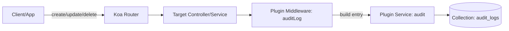

# Strapi Audit Logs Plugin

## Setup

1. Add the configuration in `config/plugins.js`:
```javascript
module.exports = {
  'audit-logs': {
    enabled: true,  // Must be true for logging to work
    excludeContentTypes: [], // Optional: content types (uid basename) to exclude from logging
    bulkLimit: 100           // Optional: max items allowed in bulk operations
  }
};
```

2. No additional setup needed - logging starts automatically!

## How It Works

The plugin automatically logs:
- All Content API create operations
- All Content API update operations
- All Content API delete operations

Each log entry contains:
- Action type (create/update/delete)
- Content type name
- Record ID
- User who performed the action (if authenticated)
- Full payload or changed fields
- Timestamp

## Configuration Options

- `enabled`: Boolean to enable/disable all logging
- `excludeContentTypes`: Array of content type names (uid basename) to exclude from logging (e.g. `['article']`)
- `bulkLimit`: Positive integer limiting the size of bulk operations

Example excluding specific content types:
```javascript
module.exports = {
  'audit-logs': {
    enabled: true,
    excludeContentTypes: [
      'article',
      'category'
    ],
    bulkLimit: 100
  }
};
```

## Architectural overview

- Middleware intercepts Content API mutations (create, update, delete), computes metadata, detects bulk operations, and delegates to a service.
- Service writes entries to an `audit_logs` collection type and exposes query/count functions to controllers.
- Admin API exposes read-only endpoints to list and fetch audit logs, protected by admin authentication and RBAC.
- Policies: `plugin::audit-logs.isEnabled` gates routes by config; `plugin::audit-logs.canRead` checks permission `plugin::audit-logs.read`.

### Architecture diagram

For a visual overview, see the high-level diagrams in `docs/architecture.md`. Here’s the main Content API → Audit flow:



## Data model

Collection type: `audit_logs` with attributes: `action` (enum), `contentType` (string), `entityId` (string), `user` (relation to `admin::user`), `payload` (json), `changes` (json), `bulk` (boolean), `bulkOperation` (json). Indexed for common queries.

## Admin API

- `GET /audit-logs` — supports filtering (contentType, user, action, date range), pagination (page, pageSize), and sort.
- `GET /audit-logs/:id`

Requires admin auth and permission `plugin::audit-logs.read`.