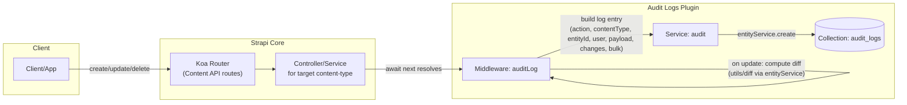
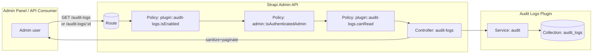

# Audit Logs – High-level Architecture

This document shows how the automated audit logging works within a Strapi application when the plugin is enabled.

## Content API mutations → Audit entries

Notes
- The middleware runs after the target route handler (await next()), so it only logs successful operations (status < 400).
- Bulk operations are detected via route handler names (createMany, updateMany, deleteMany) or an array body shape; oversized bulks are rejected with 400.
- On updates, a diff is computed between the current entity and the incoming payload to capture granular changes.
- Configuration gates behavior:
  - enabled: turn logging on/off
  - excludeContentTypes: skip specific content types
  - bulkLimit: constrain bulk operation size

## Admin API – Read access to logs

Notes
- Routes are type "admin" and protected by:
  - plugin::audit-logs.isEnabled – only accessible when the plugin is enabled
  - admin::isAuthenticatedAdmin – admin authentication
  - plugin::audit-logs.canRead – RBAC permission `plugin::audit-logs.read`
- The service populates the related `admin::user` on read; controller returns sanitized results with pagination metadata.

## Components and responsibilities

- Middleware (auditLog): observes successful Content API mutations; builds and dispatches log entries; enforces config and bulk limits.
- Service (audit): persists, queries, and counts `audit_logs`; sanitizes transient performance metadata from responses.
- Content-type: `plugin::audit-logs.audit-log` stored in `audit_logs` table/collection.
- Admin API: read-only listing and detail endpoints for admins with permission.
- Policies/Permissions: guard routes and visibility; permission `plugin::audit-logs.read` registered at startup.

## Error and performance considerations

- Logging failures never block mutations: errors are logged to Strapi logs and the request continues.
- Bulk operations are validated before writes; exceeding `bulkLimit` returns a 400 with a clear message.
- Update diffs use entityService with `populate: '*'`, which may be heavy on very large schemas; you can disable logging or exclude specific content types if needed.
